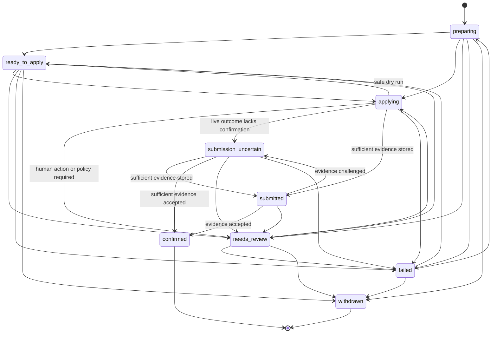

# JobTomatik Canonical Application State Model

This document describes the authoritative automation lifecycle for one JobTomatik application. The runtime graph is defined in `backend/app/services/application_state.py`; this document must not be treated as a competing source of truth.

## State diagram

## Non-negotiable invariants

1. `submitted` and `confirmed` require at least one stored `SubmissionEvidence` record marked sufficient.
2. `submission_uncertain` never advances to a submission state merely because a click occurred, a worker returned success, or a user changed the pipeline status.
3. Runtime code changes `automation_state` only through `transition_application_state`.
4. Every accepted transition creates an `ApplicationEvent` in the same transaction.
5. Browser results are persisted only when the originating attempt number is still the active `applying` checkpoint.
6. A stale or replayed worker result cannot overwrite recovery, a newer attempt, or a closed application.
7. A user-reported `applied`, `interviewing`, `offer`, or `rejected` status closes further submission work but does not fabricate employer confirmation evidence or an automated `submitted` state.
8. A stale live or unknown attempt becomes `submission_uncertain`. A stale dry run becomes `needs_review`.

## Checkpoint protocol

The application worker commits this checkpoint before browser work begins:

- automation state `applying`;
- incremented `submission_attempt_count`;
- `last_submission_attempt_at`;
- `application_attempt_started` event containing the attempt number and dry-run mode.

Immediately before returned browser evidence is persisted, the attempt-result guard locks and reloads the application. The result is accepted only when:

- the persisted state is still `applying`; and
- the persisted attempt number equals the worker's originating attempt number.

A mismatch raises into the task retry path. The retry observes the authoritative state and exits through the existing idempotency, in-progress, uncertain, or closed-application gate.

## Crash recovery

| Crash point | Authoritative recovery |
|---|---|
| Before the `applying` checkpoint commits | No attempt exists; the previous verified state remains |
| After checkpoint, before submit action | Stale dry run routes to `needs_review`; live or unknown routes to `submission_uncertain` |
| After submit action, before evidence capture | `submission_uncertain`; no retry until employer outcome is verified |
| After evidence is stored, before state transition commits | Evidence and transition share the transaction and roll back together |
| Old worker returns after recovery or newer attempt | Result rejected by attempt checkpoint guard |

## Application status versus automation state

`ApplicationStatus` is the user's broader hiring pipeline, such as `applied`, `interviewing`, `offer`, or `rejected`. `ApplicationAutomationState` describes what JobTomatik itself has verified about the submission operation.

A user may truthfully record that an application was made outside JobTomatik. That status closes duplicate submission machinery, but the automation state remains at its last verified checkpoint unless concrete evidence passes the evidence pipeline.

## Verification

`backend/tests/test_canonical_application_state_model.py` verifies:

- every source-target pair in the transition matrix;
- evidence requirements for terminal submission states;
- stale-worker attempt replay;
- partial transaction rollback;
- crash between submit action and evidence capture;
- manual status reconciliation without state fabrication;
- zero direct runtime assignments to `automation_state` outside the state service.
